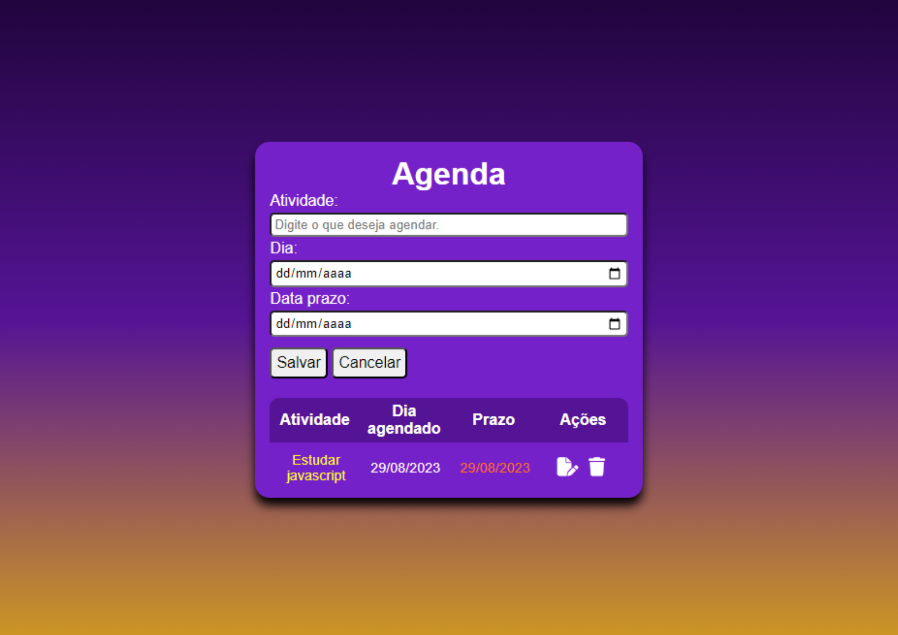

# Agenda
## Aplicativo web
Uma agenda virtual para gerenciar os afazeres do usuário.

## Layout

## Funcionalidades
- [x] Responsividade
- [x] Aramazenamento de dados(temporário)
- [x] Organização por tabela
- [x] Botões funcionais (salvar ou cancelar, editar ou apagar conteúdo)

## Tecnologias utilizadas
- HTML
- CSS
- JAVASCRIPT
- GIT

## Demonstração
[Agenda]()

## Autor
Bruno Coelho [Linkedin](www.linkedin.com/in/bruno-coelho-97b630220)